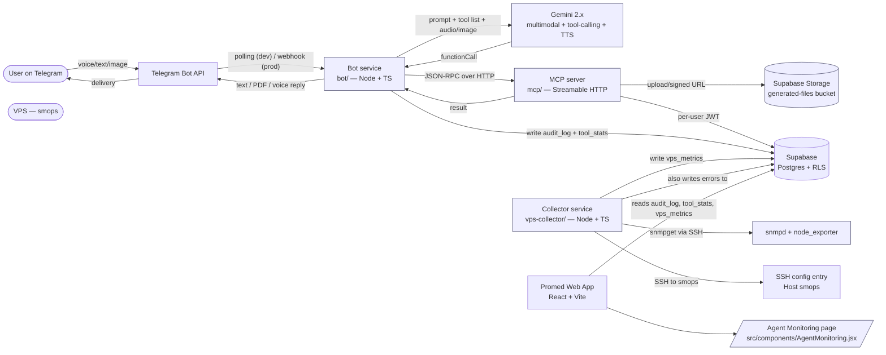

# Promed Telegram Bot + MCP Agent

## 1. Goal

Build a Telegram bot that acts as a multimodal AI agent for the Promed ERP. The user sends a voice note, text, or image; Google Gemini interprets the request; the agent calls typed **MCP tools** that mirror existing ERP CRUD verbs against Supabase on behalf of the linked user; the bot returns text, voice, tables, or generated PDFs (statements/invoices) directly into the chat. Destructive/writing actions require inline-keyboard confirmation; deletes additionally require a typed `yes, delete`.

A new **Agent Monitoring** page inside the ERP surfaces tool-call audit logs, per-tool stats, active chats, pending confirmations, error feed, Gemini usage estimates, and a live VPS health panel populated by an SSH-over-SNMP collector (the `smops` server, configured via the user's SSH config).

The system runs locally for dev (long polling, mock SSH) and migrates to the user's VPS for prod with no rewrite.

## 2. High-level architecture



**New:** `bot/`, `mcp/`, `vps-collector/`, four Supabase migrations, `docs/TELEGRAM_BOT.md`, `docs/SMOPS_COLLECTOR.md`, plus changes to `src/components/Settings.jsx` (Telegram link field) and a new route `src/components/AgentMonitoring.jsx` plus small PDF refactors.
**Reused, not rewritten:** every file under `src/components/...` and `src/utils/...` whose logic the MCP tools mirror; the `api/` serverless functions as a server-side pattern reference; existing RLS in `Supabase/*.sql`.

## 3. New components

### 3.1 Bot service — `bot/` (Node + TypeScript)

- Telegram transport: long polling for dev (default), webhook when `TELEGRAM_WEBHOOK_URL` is set.
- Dispatches `message` and `callback_query` updates to `bot/src/telegram/handlers.ts`.
- Resolves `supabase_user_id` from `telegram_links`; rejects with a `/link` hint if missing.
- Builds Gemini requests with the dynamic tool list and inline parts for voice/image/PDF.
- Translates Gemini `functionCall` into MCP `tools/call`; loops until a final answer.
- Confirmation gate: every `write` tool is held until the user clicks Confirm/Cancel/Edit; deletes additionally require typed `yes, delete`.
- Sends voice replies in v1 by asking Gemini to produce audio (or a small TTS provider) and posting via `sendVoice`, with text fallback.
- Emits one row to `bot_audit_log` per tool call, plus hourly aggregation rows to `bot_tool_stats` (per tool × 5-minute bucket).
- Exposes a `GET /healthz` HTTP endpoint on `BOT_HEALTH_PORT` (default 8081) returning `{ status, uptime_s, version, gemini_ok, mcp_ok, telegram_polling_ok }` for the collector to read.

### 3.2 MCP server — `mcp/` (Node + TypeScript, `@modelcontextprotocol/sdk`)

- Streamable HTTP transport, stateless.
- Validates `X-Mcp-Secret` and per-request user JWT (`X-User-Id`, `X-User-Jwt`).
- Registers the tool catalog (section 4); each tool runs in a Supabase client scoped to the user's JWT so RLS continues to enforce per-user isolation.
- PDF tools call the refactored `src/utils/generateInvoice.js` / `generateStatement.js` (now returning `Uint8Array`), upload bytes via the service-role client to the `generated-files` bucket, return `{ path, signedUrl }`.
- Emits one row to `bot_audit_log` per tool call (mirrors the bot's row; tagged `source='mcp'`).
- Exposes `GET /healthz` on `MCP_HEALTH_PORT` (default 8082).

### 3.3 Gemini wrapper — `bot/src/gemini/{client,prompt}.ts`

- Converts each MCP tool schema into a Gemini `functionDeclaration`.
- Accepts inline parts: text, `audio/ogg`, `image/jpeg|png`, `application/pdf`.
- TTS entry point for voice replies (Gemini output audio or fallback provider).
- Tracks estimated token / cost per call, summed into `bot_tool_stats.token_in`, `token_out`, `cost_usd`.

### 3.4 Telegram ↔ Supabase user linking

- `/link` → 6-char code → `telegram_link_codes` (15 min TTL) → user pastes into the new "Telegram" field in `src/components/Settings.jsx` → `claim_telegram_link(p_code)` RPC → bot upserts `telegram_links` on next message.
- `/whoami`, `/cancel`, `/start`.

### 3.5 Confirmation flow

- Manifest tags every tool `read` or `write`. Writes are gated by inline keyboard; deletes additionally require typed `yes, delete`.
- Pending confirmations: in-memory `Map<chatId, PendingConfirmation>` with 10-minute TTL.

### 3.6 VPS collector — `vps-collector/` (Node + TypeScript)

This is the "SSH+SNMP" piece. It is the single component that talks to the VPS, and it does so exclusively over SSH using a configured SSH entry (likely named `smops` in the user's SSH config).

**Why SSH+SNMP instead of an HTTP scraper:** the VPS may not expose inbound HTTP for Prometheus-style scraping, but SSH access is already configured for ops. The collector uses `ssh smops 'snmpget -v2c -c public localhost …'` (or equivalent `snmpwalk`) for system metrics, and `ssh smops 'systemctl is-active promed-bot && systemctl is-active promed-mcp'` for process health. SSH is the transport; SNMP is the protocol on the far side. No new daemon is required on the VPS beyond `snmpd` (standard Ubuntu/Debian package, one config line).

**Responsibilities:**
- Run every `COLLECTOR_INTERVAL_S` (default 30s) on a tick.
- For each metric in section 7.2, run an SSH command to `smops`, parse output, upsert a row into `vps_metrics` keyed by `(host, metric, ts)`.
- Run a slower 5-minute cycle that calls `curl http://localhost:8081/healthz` and `…/8082/healthz` *through the SSH tunnel* (`ssh smops 'curl -s http://127.0.0.1:8081/healthz'`) to capture bot/MCP self-reported health; write into `bot_health_snapshots`.
- Surface `ssh smops 'journalctl -u promed-bot -n 200 --no-pager'` errors into `bot_error_feed` for the dashboard.
- Expose `GET /healthz` locally for ops.
- Config: `~/.ssh/config` entry `Host smops` (already saved on this device — verified by the user). Env vars `SMOPS_SSH_USER`, `SMOPS_SNMP_COMMUNITY`, `COLLECTOR_INTERVAL_S`. The collector uses the `ssh2` Node package and resolves the host via the SSH config (`ssh smops '…'` semantics), so no private key handling is needed in the app.

**Local dev fallback:** when `SMOPS_SSH_HOST` is unset, the collector returns synthetic metrics (CPU 5%, mem 30%, processes up) so the dashboard renders during local dev without a real VPS.

### 3.7 Agent Monitoring page — `src/components/AgentMonitoring.jsx` (NEW)

A new route `/monitoring/agent` registered in `src/App.jsx`. Reads from Supabase via new read-only views; no service-role key in the browser.

Sections (in order, top to bottom):

1. **Live status strip** — bot/MCP `healthz` JSON (last snapshot, age in seconds, color), VPS CPU/RAM/disk gauge bars with threshold colors.
2. **KPI cards** — calls last 24h, success rate, p50/p95 latency, estimated Gemini cost last 24h, active chats, pending confirmations, linked users.
3. **Tool activity table** — paginated, virtualized, with filters (tool, status, user, date range). Backed by `bot_audit_log`.
4. **Per-tool charts** — line chart (calls/hour) + bar chart (success vs error) using Recharts. Backed by `bot_tool_stats`.
5. **Active chats** — list of currently active `telegram_chat_id`s, last tool, idle seconds.
6. **Pending confirmations** — admin view of all `PendingConfirmation` entries (read from a `bot_pending_confirmations` projection table that the bot writes to for visibility; the canonical store remains in-memory in the bot).
7. **Errors feed** — last 100 rows from `bot_error_feed` with severity, source, message, link to context.
8. **Linked users** — table from `telegram_links` with `linked_at`, `last_seen_at`, link/unlink actions.

All sections use the existing UI primitives (`src/components/ui/*`) and Tailwind conventions.

## 4. MCP tool catalog (initial)

Read tools = no confirmation. Write tools = inline Confirm. Deletes = inline Confirm + typed `yes, delete`.

### Clients — `mcp/src/tools/clients.ts`
- `list_clients` (read) — `{ q?, limit? }` → `{ id, name, phone, balance }[]`. Mirrors `src/components/ClientsSuppliers.jsx`.
- `get_client` (read) — `{ id }` → client + recent transactions.
- `create_client` (write) — `{ name, phone?, address?, opening_balance? }`. Mirrors `createClient` in `src/components/transactions/TransactionPage.jsx`.
- `update_client` (write).
- `delete_client` (write, double-confirm).

### Suppliers — `mcp/src/tools/suppliers.ts`
- `list_suppliers`, `get_supplier`, `create_supplier`, `update_supplier`, `delete_supplier`. Mirrors `createSupplier` / `updateSupplier` in `TransactionPage.jsx`.

### Products — `mcp/src/tools/products.ts`
- `list_products`, `get_product`, `create_product`, `update_product`. Mirrors `createProduct` / `updateProduct` in `TransactionPage.jsx`.

### Client transactions — `mcp/src/tools/clientTransactions.ts`
- `list_client_transactions` (read) — `{ client_id, from?, to?, status? }`.
- `get_client_transaction` (read) — row + lines + payments.
- `create_client_transaction` (write) — `{ client_id?, client_name?, items[], date?, notes? }`. Auto-creates the client if `client_name` matches or is new — mirrors `TransactionPage.handleSubmit`.
- `update_client_transaction`, `delete_client_transaction` (double-confirm; deletes related `payments` + `payment_allocations` first — mirrors `handleDelete`).
- `issue_invoice` (write) — sets `invoice_number` + `status='invoiced'`.
- `add_payment`, `delete_payment` (write).

### Supplier transactions — `mcp/src/tools/supplierTransactions.ts`
- Symmetric to clients, scoped to `supplier_transactions` + `supplier_transaction_payments`.

### Payments (account-level) — `mcp/src/tools/payments.ts`
- `record_client_account_payment` (write) — wraps `recordClientAccountPayment` from `src/utils/clientAccountPayments.js`.
- `delete_client_account_payment` (write) — wraps `deleteClientAccountPayment`.

### Reports / files — `mcp/src/tools/reports.ts`
- `generate_client_statement` (read) — calls refactored `buildStatementPdf(...)`, uploads to `generated-files/statements/{user_id}/{client_id}/...pdf`, returns 10-minute signed URL.
- `generate_invoice` (read) — same, `invoices/{user_id}/{transaction_id}/...pdf`.
- `generate_bulk_invoices` (read).
- `send_pdf_to_chat` — bot helper in `bot/src/telegram/files.ts`.

## 5. Gemini tool-calling and prompt design

- System prompt (section 5 of the original plan, unchanged in shape): role, language rule, tool-use rules (never invent; confirm writes; double-confirm deletes; reads → tables; writes → one sentence + new id), dynamic tool list.
- Multimodal: voice `.ogg`, image `image/jpeg|png`, PDF → existing `api/compliance/extract.js`.
- TTS for replies: `sendChatAction('record_voice')` → text → audio → `sendVoice` (with text fallback).
- Tool-call loop: hard cap 6 tool rounds/turn.
- Session memory: `Map<chatId, { turns[], lastToolSummary? }>`, 20 turns, 60-min idle TTL.

## 6. Telegram UX

- `/start` (bilingual welcome), `/link`, `/whoami`, `/cancel`.
- Inline keyboards for every write; deletes require typed `yes, delete`.
- Voice/text/image in any order; v1 replies with **voice + text + optional PDF**.
- `sendChatAction 'typing' | 'record_voice'`.

## 7. Auth, RLS, security

- Per-request user context: `X-User-Id` + `X-User-Jwt` from the link flow; MCP runs under the user's JWT so RLS is enforced.
- Service role only for: linking flow, audit writes, Storage uploads.
- Secrets: `TELEGRAM_BOT_TOKEN`, `GEMINI_API_KEY`, `SUPABASE_URL`, `SUPABASE_SERVICE_ROLE_KEY`, `MCP_SERVER_URL`, `MCP_SHARED_SECRET`, `SMOPS_SSH_USER`, `SMOPS_SNMP_COMMUNITY`. Stored in `bot/.env`, `mcp/.env`, `vps-collector/.env` locally; secret manager on VPS.
- Rate limit: 30 req/min/chat.
- Audit: every MCP call → `bot_audit_log`. Hourly rollups → `bot_tool_stats`. Never log JWTs; hash args for sensitive tools.
- Confirmation storage: in-memory only, 10-min TTL.

## 8. Data model additions

```sql
-- Supabase/supabase_telegram_links.sql
create table public.telegram_links (
  telegram_chat_id   bigint primary key,
  supabase_user_id   uuid not null references auth.users(id) on delete cascade,
  telegram_username  text,
  linked_at          timestamptz not null default now(),
  last_seen_at       timestamptz,
  is_active          boolean not null default true
);
create index telegram_links_user_idx on public.telegram_links(supabase_user_id);
alter table public.telegram_links enable row level security;

-- Supabase/supabase_telegram_link_codes.sql
create table public.telegram_link_codes (
  code         text primary key,
  user_id      uuid not null references auth.users(id) on delete cascade,
  expires_at   timestamptz not null,
  used_at      timestamptz
);
alter table public.telegram_link_codes enable row level security;

create or replace function public.claim_telegram_link(p_code text)
returns text language plpgsql security definer set search_path = public as $$
declare v_user uuid := auth.uid();
begin
  if v_user is null then raise exception 'not authenticated'; end if;
  update public.telegram_link_codes
     set used_at = now()
   where code = p_code and used_at is null and expires_at > now()
   returning user_id into v_user;
  if v_user is null or v_user <> auth.uid() then
    raise exception 'invalid code';
  end if;
  return 'ok';
end $$;

-- Supabase/supabase_bot_audit.sql
create table public.bot_audit_log (
  id                bigserial primary key,
  telegram_chat_id  bigint not null,
  user_id           uuid references auth.users(id) on delete set null,
  tool_name         text not null,
  args_json         jsonb,
  result_status     text not null,   -- 'ok' | 'error' | 'denied'
  error_text        text,
  latency_ms        integer,
  token_in          integer,
  token_out         integer,
  cost_usd          numeric(10,6),
  source            text not null default 'bot',  -- 'bot' | 'mcp'
  created_at        timestamptz not null default now()
);
create index bot_audit_log_user_idx on public.bot_audit_log(user_id, created_at desc);
create index bot_audit_log_tool_idx on public.bot_audit_log(tool_name, created_at desc);
alter table public.bot_audit_log enable row level security;

create table public.bot_tool_stats (
  bucket_start  timestamptz not null,
  tool_name     text not null,
  calls_total   integer not null default 0,
  calls_ok      integer not null default 0,
  calls_error   integer not null default 0,
  calls_denied  integer not null default 0,
  latency_p50   integer,
  latency_p95   integer,
  token_in      bigint not null default 0,
  token_out     bigint not null default 0,
  cost_usd      numeric(10,6) not null default 0,
  primary key (bucket_start, tool_name)
);
alter table public.bot_tool_stats enable row level security;

create table public.bot_pending_confirmations (
  chat_id        bigint primary key,
  user_id        uuid,
  tool_name      text not null,
  args_json      jsonb not null,
  summary        text not null,
  expires_at     timestamptz not null,
  updated_at     timestamptz not null default now()
);
alter table public.bot_pending_confirmations enable row level security;

create table public.bot_error_feed (
  id           bigserial primary key,
  source       text not null,        -- 'bot' | 'mcp' | 'collector' | 'telegram'
  severity     text not null,        -- 'warn' | 'error'
  message      text not null,
  context_json jsonb,
  created_at   timestamptz not null default now()
);
create index bot_error_feed_created_idx on public.bot_error_feed(created_at desc);
alter table public.bot_error_feed enable row level security;

create table public.bot_health_snapshots (
  source        text not null,         -- 'bot' | 'mcp'
  ts            timestamptz not null,
  status        text not null,         -- 'ok' | 'degraded' | 'down'
  uptime_s      integer,
  gemini_ok     boolean,
  mcp_ok        boolean,
  telegram_ok   boolean,
  primary key (source, ts)
);
alter table public.bot_health_snapshots enable row level security;

-- Supabase/supabase_vps_metrics.sql
create table public.vps_metrics (
  host        text not null,             -- e.g. 'smops'
  metric      text not null,             -- 'cpu_pct' | 'mem_pct' | 'disk_pct' | 'net_in_bps' | 'net_out_bps' | 'bot_up' | 'mcp_up' | 'telegram_queue_lag'
  value_num   double precision,
  value_text  text,
  ts          timestamptz not null,
  primary key (host, metric, ts)
);
create index vps_metrics_host_metric_idx on public.vps_metrics(host, metric, ts desc);
alter table public.vps_metrics enable row level security;

-- Supabase/supabase_generated_files_bucket.sql
insert into storage.buckets (id, name, public)
values ('generated-files', 'generated-files', false)
on conflict (id) do nothing;

create policy "owner reads own files"
on storage.objects for select
using (
  bucket_id = 'generated-files'
  and auth.uid()::text = (storage.foldername(name))[1]
);

-- Admin read policy for the dashboard (owner can read all monitoring tables)
create policy "owners read own audit"
on public.bot_audit_log for select using (auth.uid() = user_id);
create policy "owners read own tool stats" -- via a view
  -- implementation: expose a SECURITY INVOKER view v_bot_tool_stats that selects from bot_tool_stats
  ;
create or replace view public.v_bot_tool_stats
with (security_invoker = true) as select * from public.bot_tool_stats;
grant select on public.v_bot_tool_stats to authenticated;
```

(Exact RLS for monitoring views is finalized in Phase 1; the snippet above is the shape.)

## 9. Project structure (new files)

```
bot/
  package.json
  tsconfig.json
  .env.example
  src/
    index.ts                # entry: polling or webhook + healthz
    config.ts
    telegram/
      handlers.ts
      keyboards.ts
      linking.ts
      files.ts
    gemini/
      client.ts             # Gemini + TTS
      prompt.ts
    mcp/
      client.ts
    session/
      store.ts              # per-chat memory + pending confirmations
    audit.ts                # writes bot_audit_log, bot_tool_stats, bot_pending_confirmations, bot_error_feed
    ratelimit.ts
    logger.ts

mcp/
  package.json
  tsconfig.json
  .env.example
  src/
    server.ts               # Streamable HTTP MCP + healthz
    auth.ts
    supabase/
      userClient.ts
      adminClient.ts
    tools/
      index.ts
      clients.ts
      suppliers.ts
      products.ts
      clientTransactions.ts
      supplierTransactions.ts
      payments.ts
      reports.ts
    pdf/
      statement.ts
      invoice.ts
      fonts.ts
    schemas/
    logger.ts

vps-collector/
  package.json
  tsconfig.json
  .env.example
  src/
    index.ts                # tick loop + healthz
    ssh.ts                  # ssh2 wrapper, runs commands against SMOPS_SSH_HOST (or 'smops')
    snmp.ts                 # builds snmpget/snmpwalk commands over SSH
    parsers/
      cpu.ts
      mem.ts
      disk.ts
      net.ts
      processes.ts          # systemctl is-active promed-bot / promed-mcp
    localFallback.ts        # synthetic metrics when SMOPS_SSH_HOST unset
    logger.ts

Supabase/
  supabase_telegram_links.sql
  supabase_telegram_link_codes.sql
  supabase_bot_audit.sql          # includes bot_audit_log, bot_tool_stats, bot_pending_confirmations, bot_error_feed, bot_health_snapshots
  supabase_vps_metrics.sql
  supabase_generated_files_bucket.sql

docs/
  TELEGRAM_BOT.md
  SMOPS_COLLECTOR.md       # SSH/SNMP setup, smops config example, snmpd install, troubleshooting

src/components/Settings.jsx             # modified: Telegram field
src/components/AgentMonitoring.jsx      # NEW: /monitoring/agent route
src/App.jsx                             # modified: register the new route + nav entry in Sidebar
src/utils/generateInvoice.js            # refactored: buildInvoicePdf() -> Uint8Array
src/utils/generateStatement.js          # refactored: buildStatementPdf() -> Uint8Array
```

The PDF refactor is the only behavioural edit to existing JS: replace trailing `doc.save(fileName); return fileName;` with `return doc.output('arraybuffer')` and add a thin adapter so the existing modals still trigger download.

## 10. Phased delivery

**Phase 1 — MVP (read-only + statements + monitoring skeleton, polling, voice replies)**
- `bot/`, `mcp/` skeletons; Streamable HTTP transport; Telegram polling.
- All five SQL migrations (including the monitoring tables).
- `/link` flow + `Settings.jsx` field.
- Read tools: `list_clients`, `get_client`, `list_supplier_transactions`, `get_client_transaction`, `generate_client_statement`, `generate_invoice`.
- Bot: text + voice replies, English or Arabic, session memory, `bot_audit_log` writes.
- `vps-collector/` with local fallback only (no real SSH yet).
- `AgentMonitoring.jsx` route with the live status strip, KPI cards, tool activity table, errors feed, linked users. Per-tool charts and pending confirmations deferred to Phase 2.
- `docs/TELEGRAM_BOT.md`, `docs/SMOPS_COLLECTOR.md`.

**Phase 2 — Writes + multimodal + double-confirm + real SSH**
- All remaining tools with confirmation flow; deletes require typed `yes, delete`.
- Voice (`.ogg`) and image (`image/jpeg`) inline parts; PDF → existing extractor.
- Rate limiting + structured logging + secret manager.
- `vps-collector` real SSH path: connect to `smops` via `ssh2`, run `snmpget -v2c -c $COMMUNITY localhost …`, run `systemctl is-active` for processes, write to `vps_metrics` and `bot_health_snapshots`.
- `AgentMonitoring.jsx` adds per-tool charts, active chats, pending confirmations, Gemini cost card.

**Phase 3 — VPS deployment + hardening**
- Switch bot transport to webhook.
- Deploy bot, MCP, and collector to the VPS (systemd units: `promed-bot.service`, `promed-mcp.service`, `promed-collector.service`).
- `snmpd` installed and running on VPS; snmpd config committed to `docs/SMOPS_COLLECTOR.md`.
- Reverse proxy, TLS, secret manager.
- Optional: WebSocket transport for MCP so IDE clients (Claude Desktop, Cursor) reuse the same tool catalog.

## 11. Confirmed decisions

- Voice replies in v1 (`tts_v1`).
- Deletes use inline Confirm + typed `yes, delete` (`double_confirm`).
- Long polling locally, webhook on VPS (`polling_v1`).
- Refactor PDF utilities to return `Uint8Array` and share between web + MCP (`refactor_share`).
- **NEW** Monitoring: new `/monitoring/agent` page in the ERP, reading from Supabase (`erp_page_supabase`), with all six metric categories: audit log table, per-tool stats, active chats and pending confirmations, Gemini cost estimate, errors feed, linked users.
- **NEW** SSH+SNMP: bot/MCP host metrics come from an SSH-driven SNMP collector (`vps-collector/`) that connects to the VPS over SSH (target entry confirmed as `smops` in the user's `~/.ssh/config` on this device), runs `snmpget` against localhost, and writes to `vps_metrics` and `bot_health_snapshots`. Collector has a local-dev fallback that emits synthetic metrics so the dashboard renders before the VPS is wired up.

## 12. Citations

- [src/utils/generateInvoice.js](src/utils/generateInvoice.js) — refactored to `buildInvoicePdf(): Promise<Uint8Array>`.
- [src/utils/generateStatement.js](src/utils/generateStatement.js) — same.
- [src/utils/clientAccountPayments.js](src/utils/clientAccountPayments.js) — `recordClientAccountPayment` / `deleteClientAccountPayment` wrapped by the payments MCP tools.
- [src/components/transactions/TransactionPage.jsx](src/components/transactions/TransactionPage.jsx) — canonical CRUD verbs mirrored by the MCP tools.
- [src/components/ClientsSuppliers.jsx](src/components/ClientsSuppliers.jsx) — `fetchData` read pattern mirrored by `list_clients` / `list_suppliers`.
- [src/components/Settings.jsx](src/components/Settings.jsx) — gains a "Telegram" link field.
- [src/components/Sidebar.jsx](src/components/Sidebar.jsx) — gains a "Monitoring" nav entry linking to `/monitoring/agent`.
- [src/App.jsx](src/App.jsx) — gains the `/monitoring/agent` route registration.
- [src/lib/supabase.js](src/lib/supabase.js) — browser client used by the Settings link flow and the monitoring page.
- [src/components/ui/*](src/components/ui) — reusable UI primitives the monitoring page composes from.
- [api/_lib/supabaseAdmin.js](api/_lib/supabaseAdmin.js), [api/_lib/extraction/providers/gemini.js](api/_lib/extraction/providers/gemini.js) — server-side pattern reference.
- [Supabase/supabase_schema.sql](Supabase/supabase_schema.sql), [Supabase/supabase_user_id_rls.sql](Supabase/supabase_user_id_rls.sql), [Supabase/supabase_account_payments.sql](Supabase/supabase_account_payments.sql) — base schema, RLS style, `payment_allocations`.